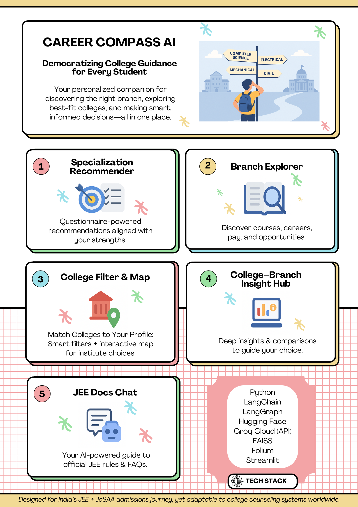

# Career Compass AI

## Democratizing College Guidance for Every Student

*Your personalized companion for discovering the right branch, exploring best-fit colleges, and making smart, informed decisions—all in one place*

---

## 📌 Project Poster


👉 Scroll down for the **full poster** in high resolution.

---

## 🚀 Features

### Modules
1. **Specialization Recommender**  
   *Questionnaire-powered recommendations aligned with your strengths.*

2. **Branch Explorer**  
   *Discover courses, careers, pay, and opportunities.*

3. **College Filter & Map**  
   *Smart filters + interactive map for institute choices.*

4. **College–Branch Insight Hub**  
   *Deep insights & comparisons to guide your choice.*

5. **JEE Docs Chat**  
   *Your AI-powered guide to official JEE rules & FAQs.*

---

## 🛠️ Tech Stack
- **Core**: Python  
- **LLM & AI Frameworks**: LangChain, LangGraph, Hugging Face, Groq Cloud (API)  
- **Vector Search**: FAISS  
- **Frontend / UI**: Streamlit, Folium (for interactive maps)  
- **Data Handling**: Pandas, NumPy, Unstructured  

---

## 🔗 Download Prebuilt Vector Store

The vector store is not included in this repository due to GitHub’s file size limits.  
To use the app without rebuilding embeddings from scratch, download the prebuilt vector store:

📥 [Download vector_store from Google Drive](https://drive.google.com/drive/folders/1A2ibtHlumIechILpXJdSS4YTl2QbDaWi?usp=sharing)

After downloading place the folder inside the project directory:

project-root/
├── src/
├── main.py
├── vector_store/ <-- place it here
└── ...

## ⚙️ Setup

1. Clone the repo:  
   ```bash
   git clone https://github.com/your-username/careercompass.git
   cd careercompass


## Context

This project is designed in the context of **India’s JEE exam** and the **JoSAA counseling process**, empowering students to explore branches, compare colleges, and make informed career decisions. That said, this can be adaptable to college counselling systems worldwide.

## License

This project is licensed under the [MPL 2.0 License](./LICENSE).

